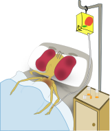
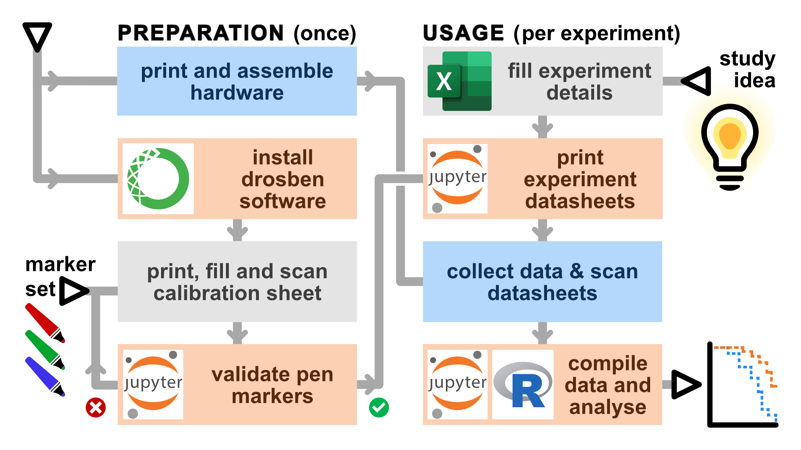
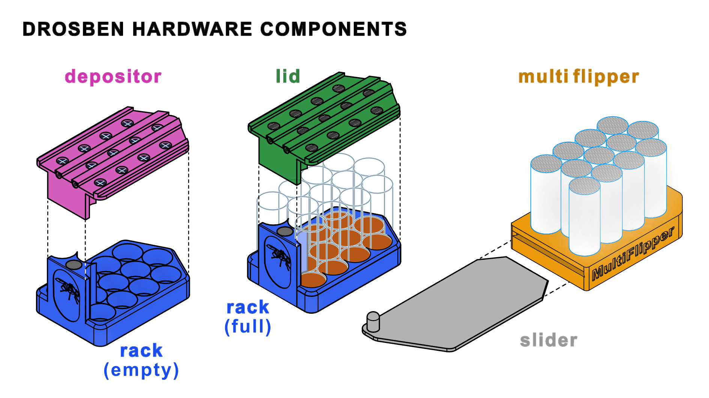
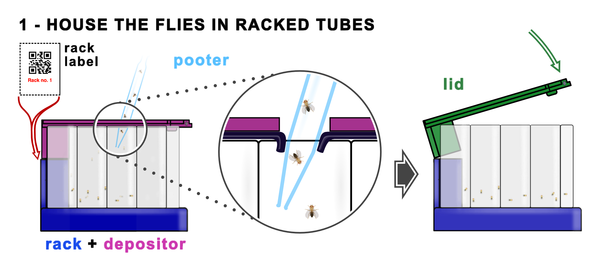
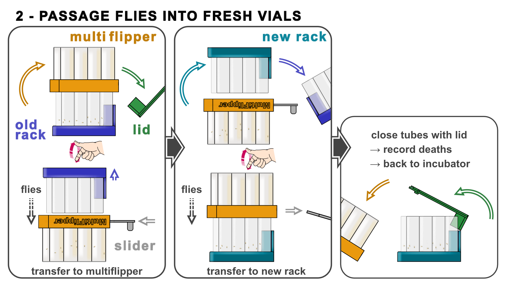
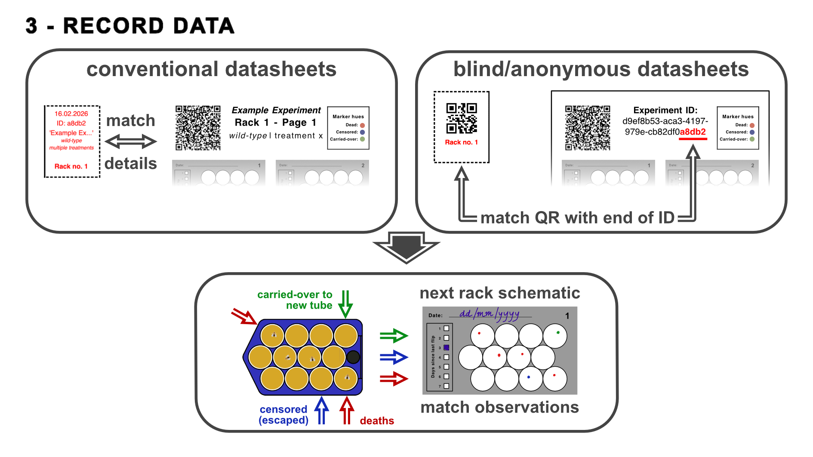

[](https://doi.org/10.5281/zenodo.20999933)



# Drosben: a method for scaling up lifespan analysis of _Drosophila_

_Drosophila melanogaster_ is a powerful model organism to study ageing, or any other processes where lifespan is a useful life history trait, because the fly lends itself to large demographic studies to measure survival time and mortality rates. However, performing these experiments is time-consuming, as they require many manual passages of fly vials to keep them on fresh food and record events. 

We have developed a toolkit that allows transferring flies from 12 tubes into fresh ones ('flipping') simultaneosly, which we have named _Drosben_ (a portmanteau of _Drosophila_ and _trosben_, Welsh for sommersault). Drosben comprises both hardware (which can be made cheaply with 3D printing and minimal DIY modifications) and software (a simple python module with notebooks for usage). One speeds the manual labour, and the other one speeds the data recording -- producing a quick preliminary analysis and a spreadsheet ready to be analysed in a more targeted way in R with the package `survival`.

Please refer to our paper describing the Drosben system together with a few new observations using this approach:

---
Drosben preprint (TBD):  
Terrence M Trinca and Joaquín de Navascués (2026).
The Drosben approach for affordable and scalable survival analysis with _Drosophila_
bioRxiv doi: [10.1101/2020.0X.YY.ZZZZZZ](https://www.biorxiv.org/content/10.1101/ZZZZZZv1).

---

# Overview

The Drosben system comprises:

- **3D-printed hardware** that has to be printed and assembled (glueing and some cutting).
- **Software** that has to be installed manually and used in three steps:

- _'Colour calibration'_ to validate a set of 3 marker pens for automatic recognition (done only once or if a new pen set needs to be tested);
- _'Experiment initialization'_ to record experimental design details and produce experiment-specific data recording sheets (done once per experiment);
- _'Data compilation/analysis'_ to capture the data from scanned datasheets (done once at the end of an experiment, but can also be done along the way to monitor progress).



---

# 1. The Drosben hardware

The hardware components are designed to improve handling speed of vials during fly transfer to fresh food.


## 1.A. Components

The Drosben hardware components are:
- The rack and lid that houses 12 _Drosophila_ vials,
- The depositor for distributing the flies initially into the vials,
- The multiflipper and its slider, for transferring the flies from a rack into another one with fresh vials.




## 1.B. Required equipment and materials  

See the [hardware README](../hardware/README.md) for the model files for 3D printing and some details on their assembly/preparation for usage.

+ **A 3D printer** capable of printing 1.75 mm PLA or ABS filament. We have printed the necessary parts successfully in a [Prusa i3 MK3S+](https://www.prusa3d.com/product/original-prusa-i3-mk3s-10th-anniversary-edition-3d-printer/) and a [Bambulab A1 mini](https://bambulab.com/en/a1-mini). Alternatively, you can send the files to a printer shop.

+ **Slicing software** for your 3D printer. We have used Cura Ultimaker and Bambulab Studio.

+ **Clear acrylic tube** with 25 mm outer diameter and 2 mm thickness (23 mm ID). These can be bought cut to measure from local or online retailers, or bought by the metre and take to a workshop for cutting. A cheaper alternative is to buy a long piece and cut it down yourself (see the [hardware README](../hardware/README.md)).

+ **Stainless steel or plastic thin mesh**; those described for insect netting would work and are relatively cheap. A piece of ~15 x 20 cm will be enough for a single Multiflipper.

+ **Cyanoacrylate-based universal glue** such as those manufactured by Gorilla, Everbuild or Superglue. There is no need to use a special manufacturer nor presentation (i.e. gel or highly penetrant).

+ **Silicon rubber sheet** of 1mm thickness, cut from a piece of approximately 30 x 20 cm (half to make a single Depositor, the other half to protect the Slider while gluing the Multiflipper).

+ **N45 Neodymium magnets** (3mm thick, of diameters 12mm and 6mm). Four will be needed for one Multiflipper (6mm &#x2300;), two for one Rack and Lid, and one for a Depositor (12mm &#x2300;).

> [!TIP]
> The fumes from the cyanoacrylate may leave a frost mark on the acrylic tubes; to prevent this, one may use use instead acrylic-specific glue to bind the tube segments to each other.

> [!CAUTION]
> **[1]** 3D printers release plastic microparticles and therefore pose a chemical hazard: make sure you follow local health and safety rules (and common sense) if you print yourself. **[2]** Cutting acrylic tubing yourself poses safety hazards (cuts and grazes): make sure you follow local health and safety rules (and common sense) if doing so. This also applies (somewhat less so, but to some extent) to rubber sheet. **[3]** Both cyanoacrylate and acrylic glues pose chemical hazards: make sure you follow local health and safety rules (and common sense) when using them.

## 1.C. Hardware usage

The Drosben hardware is used in three steps.

First, print and cut the rack labels for your experiment and place each in the slot of a rack, so you can see experimental conditions. Place the corresponding flies in each of the tubes using a pooter, with the distributor covering the tubes. The rubber valves of the distributor (see the [hardware README](../hardware/README.md)) prevent flies from escaping. Quickly swap the distributor by a lid, where instead of valves, slits allow breathing. Both snap in place thanks to the rare-earth magnets and two rigid push-click spots. This starts the experiment. If you want to record the data blind to the experimental conditions, flip now each rack label so it is the QR side that shows.



Next, and every time flies need passaging into vials with fresh food, swap the lid by the multiflipper, flip the assemble and gently tap the flies into the multiflipper chambres; cover them with the slider, which will be held in place by magnets (see the [hardware README](../hardware/README.md)). Set the rack with old tubes aside for recording deaths and place a new one on top of the multiflipper. Remove the slider, flipe the assemble and tap the flies into the new tubes. Swap the multiflipper and the lid and place the tubes in the incubator.



Finally, every time you passage the flies, identify the datasheet corresponding to the rack you are passaging. Explicit datasheets will have the rack no. and the experiment 'name' and conditions in the header. For blind recording, read the QR code with the phone and match the reading with the last 5 characters of the experiment ID. Then, on the next available grid on the datasheet, record:
- days since last flip,
- deaths (matching the dead flies stuck to the bottom of the tubes),
- censorings (escaped flies or flies stuck alive to the bottom of the tubes), and
- carried-overs (dead flies that fall into the fresh vials).
When the experiment is finished (or you want to inspect the data), scan the datasheets and use the software.



# 2. The Drosben software

We wrote a python package to speed up the data collection, both when recording fly deaths and when compiling the observations in electronic form. It takes advantage of the shape of the tubes as held in the rack, so the user at the bench can quickly record deaths as pen marks on a printed template; then these can easily be scanned, automatically detected with computer vision, and compiled into a spreadsheet for analysis. So, while the hardware can be used without the software, this is not the case the other way around; however, the drosben system is more effective when both hardware and software are used together.

Apart from the hardware components, you will also need:

+ A colour printer
+ A device to scan A4 documents (ideally, a flatbed scanner, but a phone can work too)
+ 3 colour markers. We normally use Sharpie fine point markers in red, green and blue. More colourblind-friendly combinations could be obtained using yellow, orange, blueish red, purple light and blue.

> [!IMPORTANT]
> **Why using 3 colours?** Most of the data is collected with one colour (dead flies). However, sometimes flies can escape; while they can be ignored, the best practice is to record these as censored events -- hence the second colour. The third colour comes from the fact that, occasionally, a dead fly does not get stuck to the food; it dries too quickly and is carried over the new tube with the alive flies. These 'events' can be detected easily because the 'carried-over' corpses fall to the bottom of the tubes and remain immobile in unnatural positions. Recording this as a normal death can lead to counting the same dead fly as many times as it is carried over until it gets stuck to the food. So, every carried-over event has its own colour, and by recording them every flip they are detected, the software back-tracks the time of observed death to the first carried-over event.

## 2.A. Installation and start

### Installation with _no previous experience_ in programming

If you have _any_ experience programming in Python, you probably can jump to the [next section](#with-some-programming-experience). If you do not have Python or '(ana)conda' installed in your system (or do not know if you do), this section is meant for you.

We are not experienced programmers, so neither our software nor its installer have polished user interfaces. However, they are simple enough and the steps are very constrained. Just bear in mind that instead of clicking and dragging-and-dropping, you will have to type in some simple commands, which we have tried to minimise and explain step by step.

We have written the drosben software in the Python language, using a few specific Python libraries (specialised extensions of the language). For our software to work, specific versions of both Python and the libraries need to be installed together; this is called an 'environment' (for some beginner explanations, see [here](https://realpython.com/python-virtual-environments-a-primer/), [here](https://www.w3schools.com/python/python_virtualenv.asp) or [here](https://www.anaconda.com/blog/anaconda-python-complete-beginners-guide).

Once you have the environment set up, you can open in it a 'working environment', JupyterLab, from where to open and run the so-called 'ipython notebooks' - a sort of live documents where you can mix formatted text (which we use to give you instructions) and snippets of code (which will work as the buttons and check boxes of a polished user interface). You can find basic explanations of what Jupyter Notebooks are and what they look like [here](https://www.datatoinsight.org/jupyter-notebooks) and [here](https://www.datatoinsight.org/jupyter-notebooks); for a bit more information look [here](https://www.datatoinsight.org/jupyter-notebooks) (shortcuts and hotkeys) or [here](https://www.dataquest.io/blog/jupyter-notebook-tutorial/) (with basic exercises); for a video tutorial, I suggest you look [here](https://www.youtube.com/watch?v=Ou-7G9VQugg). All these will give you more than you need, as we will only ask you to:
- open a notebook within JupyterLab
- 'run cells' (Shift-Enter)
- type in some cells the paths to the scans where you collected the data, guided by the instructions.

All this may sound like a lot, but it will be taken cared of by the 'environment manager' [Anaconda](https://www.anaconda.com/). Anaconda has paid options, but to run drosben, a free licence works perfectly; you just need to register.

#### Installing Anaconda

You first need to decide [which Anaconda version you want](https://www.anaconda.com/docs/getting-started/anaconda/install). Anaconda has two interfaces: a graphical one (the 'Anaconda-Navigator') and a command-line. The full version of Anaconda includes the Navigator and takes a minimum of 5Gb of hard disk space. If this is a concern to you, you can instead install Miniconda, which by default only has the command-line interface (CLI). Linux and MacOS systems have built-in 'command-line terminal' apps from where to use the CLI. Windows systems typically do not, but both Anaconda and Miniconda for Windows come with their own terminal apps: "Anaconda Prompt" (just to operate anaconda) and "Anaconda PowerShell Prompt" (more general-purpose). Alternatively, you can install a separate program to run command-line terminals. [MobaXterm](https://mobaxterm.mobatek.net/) is a general-purpose terminal utility and its free home licence is enough for running drosben. 

So, to install Anaconda, visit their [download page](https://www.anaconda.com/download), choose the system (Win/Mac/Linux) and version ('Ana'/'Mini') and run the installer. All of this is done clicking - no command line needed.

#### Copying the drosben source code

At the top of this GitHub page, click on the $${\color{#3E7E40}{\textsf{<> Code &#x2304;}}}$$ button and select 'Download ZIP'. Unzip the contents and move the folder to where you want it to be.

#### Creating the drosben environment

**With Anaconda-Navigator:** Open the Navigator and follow the instructions from the Anaconda tutorial to [import an environment](https://www.anaconda.com/docs/tools/anaconda-navigator/tutorials/manage-environments#importing-an-environment) using a local `.yml` file. The local file for you is `environment.yml`, directly in the `drosben/` folder you just unzipped.

**With command-line:** Open a terminal in your system.
- Linux: press the Super key and type 'terminal'.
- MacOS: navigate to Applications > Utilities > Terminal
- Windows: press the Windows key, type 'Anaconda Prompt' or your utility of choice
Once in the terminal, just run in your terminal (copy-paste-&#x21B5;):
```{bash}
# navigate to where the drosben repository is
cd ~/where/you/have/drosben # substitute this path for the one in your system
# create the environment (drosbenV - name determined by environment.yml)
conda env create -f environment.yml
# activate it
conda activate drosbenV
# install the drosben package as local source
# (this is installed in the drosbenV environment)
pip install drosben
# ONLY if you installed miniconda, JupyterLab needs to be installed separately:
# (this is installed in the drosbenV environment)
conda install -c conda-forge jupyterlab -y
```
Simple!

---

### Installation _with_ any programming experience

If you have any programming experience with python, you can probably jump over this paragraph. If you have programming experience but not with python: for the software to work reproducibly, we need an environment with a specific version of python (3.11) and the libraries used (some in specific versions, too). The environment manager Anaconda does this and installs JupyterLab (an IDE to run the code through computing notebooks).

- [Install Anaconda](https://www.anaconda.com/download) in whichever version you prefer, if you need to.
- Open a shell terminal and run:
```bash
# clone the repository and go to its top directory
cd ~/where/you/want/the/repo
git clone https://github.com/jdenavascues-trincatalyst/drosben.git
cd drosben
# create the environment
conda env create -f environment.yml
# activate it
conda activate drosbenV
# install the drosben package as local source
pip install drosben # note ~/.../drosben is the working directory
# if using miniconda, add JupyterLab
conda install -c conda-forge jupyterlab -y
```

---

### Running the program once installed

JupyterLab will run the notebooks from where you can use the drosben software. To start JupyterLab:

**With Anaconda-Navigator:** Launch the Navigator, go to the Home tab, and find the drop-down menu that selects the environment. It is at the top and will probably read "_All applications_ on _base (root)_". Change _base (root)_ for _drosbenV_, and click on the JupyterLab launch icon.

**With command-line:** In a shell terminal, run:
```bash
conda activate drosbenV
cd ~/.../drosben # so jupyterlab starts there and notebooks are easy to find
jupyter lab
```

Once JupyterLab is active, navigate interactively to the `drosben/notebooks/` directory and open the Notebook you need. The first time, do it in their numerical order. Any alternative IDE that can run the notebooks should work, too.

---

## 2.B. Usage and data analysis

The easiest way to use the software is to run the Jupyter notebooks in order:
+ [Colour test template](src/drosben/resources/colour_cal_printout.pdf): Print, fill and scan this template start Notebook #01 (see notebook for detailed instructions).
+ [Notebook #01](/notebooks/01_First_Use_Colour_Calibration.ipynb): Validate the pen markers to ensure the three colours will be discriminated without human supervision. This needs be done only once, unless you change the colours.
+ [Excel template](src/drosben/resources/experiment_template.xlsx): Before you start an experiment, fill in the experimental details in an Excel template file.
+ [Notebook #02](/notebooks/02_Initialize_Experiment.ipynb): Read the experiment metadata from the Excel template and generate
    - experiment-specific data recording sheets. These can be anonymous for blind data collection, if desired, and
    - Labels for each of the racks used for the experiment racks (both anonymous or identified).
    - This only needs be run once per experiment.
+ [Notebook #03](/notebooks/03_Read_DataSheets_Analyse_Data.ipynb): Compile the observations recorded in scanned datasheets and run an automated preliminary analysis of the data. This can be done all at once at the end of the experiment or incrementally, in multiple rounds along the way.

Recommendations for scanning datasheets and colour calibration sheets:
- Scan the papers at ≥150 dpi
- Save in TIFF/JPEG/PNG/PDF format
- You can use a phone or a flatbed scanner (but see below)
- For datasheets in particular:
    + They require minimal skew (which can be corrected up to a few degrees) or perspetive distorsion (which is not corrected by drosben and needs to be adjusted beforehand).
    + QR corner MUST be visible.

### Further analysis in R

The output of the python notebooks will be a spreadsheet (XLSX/CSV) that can be analysed in python, but is best analysed using the `survival` package in R. The libraries for survival analysis in python are simply not as well developed as in R. To use R, the easiest way is:

- Download the R installer for your system from [CRAN](https://cran.r-project.org/) and follow its instructions for installation.
- Download the RStudio Desktop installer from [posit](https://posit.co/download/rstudio-desktop/) and follow its instructions for installation.
- A nice introduction from absolute zero to R and RStudio is provided by [the Sydney R-Ladies](https://rladiessydney.org/).
- You will need to install the packages [`survival`](https://cran.r-project.org/web/packages/survival/) by Terry Therneau and [`survminer`](https://cran.r-project.org/web/packages/survminer/index.html).
- We do not cover the use of these here at this point. There are multiple tutorials that show how to use these libraries:
    - [Tutorial by Emily Zabor with some basic theory](https://www.emilyzabor.com/survival-analysis-in-r.html)
    - [Tutorial by Shariq Mohammed](https://shariq-mohammed.github.io/files/cbsa2019/1-intro-to-survival.html)
    - [Tutorial at UCLA with some theory](https://stats.oarc.ucla.edu/wp-content/uploads/2025/02/survival_r_full.html)
    - [Tutorial at Datacamp](https://www.datacamp.com/tutorial/survival-analysis-R)
    - [Tutorial by Ho Thi Nhan](https://bookdown.org/nhanhocumc/biodata-r/survival.html)
    - [Tutorial by Aura Frizzati](https://rpubs.com/auraf285/SurvAnalysisR)
    - There's plenty more around...

## 2.C. Troubleshooting

(Under construction)

### Environment issues

If `conda env create -f environment.yml` fails to solve, try the more prescriptive installs (where the versions are more rigidly specified).

First using the pinned `.yml` file, where package versions are specified:
```bash
# with the repository top folder drosben/ as your working directory:
conda env create -f environment_pinned.yml
# follow up with environment activation, etc
```

If that fails, try cloning a locked environment that we used successfully:
```bash
# with the repository top folder drosben/ as your working directory:
conda-lock install -n drosbenV -f conda-lock.yml
# follow up with environment activation, etc
```

### Test the installation

- To run tests:
```bash
pytest -q
```
If this runs without errors, you should be ready to go.


### Jupyter does not seem to have the right libraries

JupyterLab and the Jupyter notebooks will only be 'aware' of drosben if they were initialised within the `drosbenV` environment. If you try to run the notebooks code cells and you get error messages along the lines of `` maybe you have not started from this environment. Create a new cell in the notebook and run:
```python
import os
print(os.environ['CONDA_DEFAULT_ENV'])
del os
```
This code block should print `drosbenV`. If it doesn't, exit JupyterLab with File > Log Out, go back to Anaconda-Navigator or your Terminal and try again the [instructions above](#running-the-program-once-installed).

---

# 3. Contact

- [**Terrence M Trinca**](https://www.bristol.ac.uk/people/person/Terrence-Trinca-4379516b-71e2-40a1-9e22-a4a3fb2bdda9/)
- [**Joaquín de Navascués**](https://www.essex.ac.uk/people/DENAV35604/Joaquin-De%20Navascues)

---

# 4. Acknowledgments

* Hat tip to all the programmers from whom we took tips and tricks found in StackOverflow and GitHub. Their contributions are linked in comments in the code.
* The sickly fly was drawn by [Cristina Fernández García](https://es.linkedin.com/in/fernandezgarciacristina).
* Thanks to our former colleagues at the School of Biosciences, Cardiff University, who helped us assess the speed gain using Drosben.
* [Flying fly silhouette in one of the figures](https://www.vexels.com/vectors/preview/170043/fly-insect-silhouettes")

---

# 5. License

The contents of this repository are shared through the MIT licence. 

---
