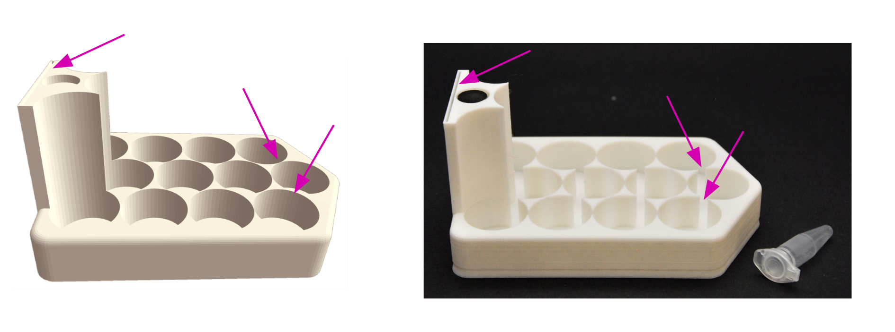
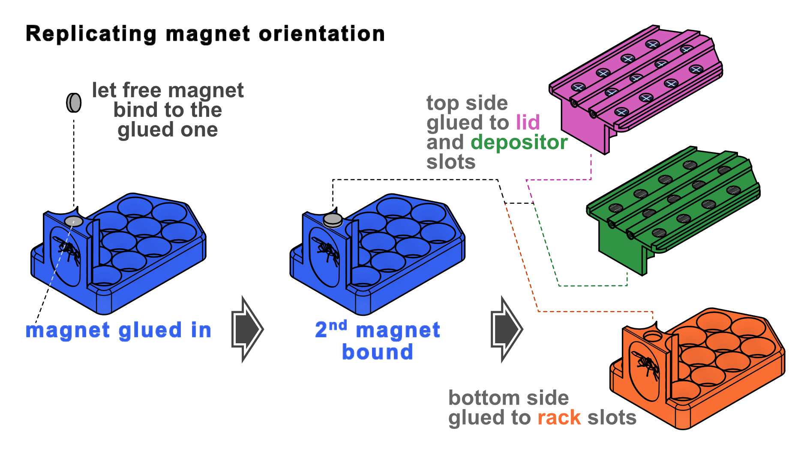

# Instructions to assemble the Drosben components

You will need:

## Component costs[^*]

| Component | Quantity | Required[^a] | Cost per usage unit |
| :--- | ---: | :--- | ---: |
| (initial materials) | 1 | Per lab | £71.00 |
| Depositor stencil | 1 | Per lab | £0.14 |
| Multiflipper | 1 | Per user | £38.91 |
| Slider | 1 | Per user | £0.50 |
| Depositor | 1 | Per user | £3.49 |
| Rack | 2 | Per cohort | £2.28 |
| Lid | 1 | Per cohort | £0.90 |

## Materials costs

| Material | Quantity (per pack) | Unit | Price[^b] |
| :--- | ---: | :--- | ---: |
| PLA filament | 1000 | g | £18.00 |
| Acrylic tube | 1 | count | £3.00 |
| Nail shaft | 200 | count | £3.50 |
| N52 magnet 12 x 3 mm | 50 | count | £12.00 |
| N52 magnet 10 x 3 mm | 50 | count | £12.00 |
| Woven wire mesh | 3600 | cm² | £20.00 |
| Super glue gel | 30 | g | £4.00 |
| Acrylic cement | 50 | ml | £9.00 |
| Rubber sheet | 100 | cm² | £3.00 |

## Recipes

| Component | Material | Quantity | Unit | Cost per component |
| :--- | :--- | ---: | :--- | ---: |
| Multiflipper | PLA filament | 40 | g | £0.72 |
|  | Acrylic tube | 12 | count | £36.00 |
|  | N52 magnet 10 x 3 mm | 4 | count | £0.96 |
|  | Woven wire mesh | 120 | cm² | £0.67 |
|  | Super glue gel | 0.2 | g | £0.03 |
|  | Acrylic cement | 3 | ml | £0.54 |
| Depositor | PLA filament | 21 | g | £0.38 |
|  | Rubber sheet | 100 | cm² | £3.00 |
|  | Nail shaft | 4 | count | £0.07 |
|  | Super glue gel | 0.3 | g | £0.04 |
| Lid | PLA filament | 32 | g | £0.58 |
|  | N52 magnet 12 x 3 mm | 1 | count | £0.24 |
|  | Nail shaft | 4 | count | £0.07 |
|  | Super glue gel | 0.1 | g | £0.01 |
| Rack | PLA filament | 50 | g | £0.90 |
|  | N52 magnet 12 x 3 mm | 1 | count | £0.24 |
| Slider | PLA filament | 26 | g | £0.47 |
|  | Nail shaft | 1 | count | £0.02 |
|  | Super glue gel | 0.1 | g | £0.01 |
| Depositor stencil | PLA filament | 8 | g | £0.14 |

## Tools

| Tool | Assumed available | Cost | Optional[^c] |
| :--- | :---------------: | ---: | :------: |
| Pliers (to clip nail heads) | yes | £10.00 | no |
| Cutter (to cut mesh and rubber sheet) | yes | £10.00 | no |
| 3D printer | yes | £140.00 | no |
| Silicon sheet, 0.5 mm thick (to glue the multiflipper) | no | £4.50 | no |
| Arc saw | yes | £10.00 | yes |
| 25 mm pipe cutter | yes | £50.00 | yes |
| 3D-printed tube cutter reference tool[^d] | yes | £1.50 | yes |

[^*]: Prices were estimated in July 2026.
[^a]: The Depositor and Multiflipper could be shared between users, but for real scalability, it is better to assume they will not be. A rack can house cohorts of up to 180 flies (15 per tube).
[^b]: Prices have been ceiled to the nearest £1. These are realistic indicative prices, but the exact cost of the initial investment and component may change depending on the specific retailer and the configuration of the pack. Most components have been obtained from non-specialist online retailers, except the acrylic tubing and the woven wire mesh, which are respectively from Simple Plastics and The Mesh Company (both UK companies).
[^c]: Optional tools allow the user to buy 25 mm acrylic tubing in 1 m lengths and cut out their own segments for the multiflipper chambers. This makes the tubes, which are one of the most expensive parts, a bit cheaper (as each cut needs to be paid for separately).
[^d]: The model is within the 'Utilities' folder as 'tube_cutter_reference'.

## Building the Racks

### Printing

Our latest prints were printed in a Bambulab A1 mini with plain PLA after slicing in BambuStudio with:

- the base of the Rack facing the printer's bed;
- preset configuration _0.08 mm High Quality preset_;
- support enabled (with support default settings).

The rack is the only model with very thin areas, where the tubes almost touch and in the sleeve to hold the label. We have not managed to print both faithfully - it seems to be either one or the other:

In our experience, hosting the tubes firmly does not need the full cylinder slot - the curved triangles are enough to keep the tubes secured. So we favour printing racks with functional sleeves, for which those settings work well.

### Post-printing modifications

Simply add a drop of cyanoacrylate glue gel to the slot for the magnet and place an N52 neodymium disk magnet (12 x 3 mm) there.

> [!TIP]
> You will want **all** your racks to have their magnets in the **same orientation**, so all your lids are compatible with any rack. But rare-earth magnets do not indicate their polarity. So, once you have glued the magnet to the first rack, use it as an indicator (once the glue has set!): let the next magnet you glue first attach to the glued magnet, add a drop of glue to the slot where it is going to go, and place it there in the required orientation as indicated in the schematic:
> 

- using the first one as template!!! (PHOTO/VIDEO/EXAMPLES)

## Building the Lids

### Printing

Our latest prints were printed in a Bambulab A1 mini with plain PLA after slicing in BambuStudio with:

- the top side of the Lid facing the printer's bed;
- preset configuration _0.12 mm High Quality preset_;
- support enabled (with support default settings).

### Post-printing modifications

Before gluing, check that the nails enter the opening of the rails with adequate tolerance. If they are too tight, get narrower nails or scrape the inner walls of the rails with a needle or a round coping saw blade. Once you are satisfied, cut off the heas of four nails, add a drop of glue to the tips and push them into the rail's cavities until the nails' ends are flush with the rail openings.

## Building the Multiflipper

- Buy tubes cut to measure or cut tubes with cutter tool (PHOTOS/VIDEO)
- To cut the tubes for the multi flipper: https://www.youtube.com/watch?v=mZk1wDfr2mY
- Show glueing with tensol 12 - PHOTO
- Show glueing with superglue - SCHEMATIC
- Frosting (PHOTO)
- Gluing magnets

## Slider

- gluing nail PHOTO

## Depositor

- using the stencil, PHOTOS
- gluing rubber and nails - no need of photos

---
